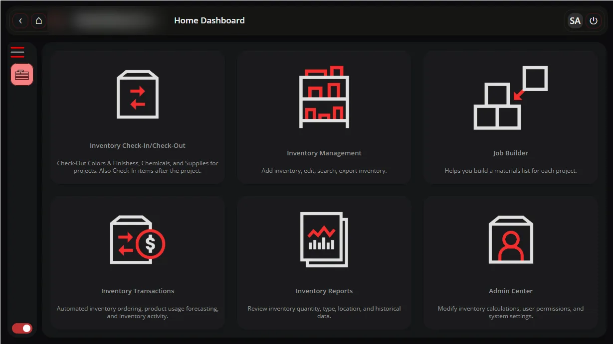
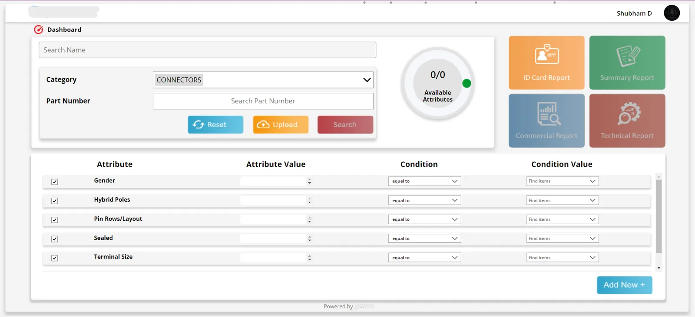
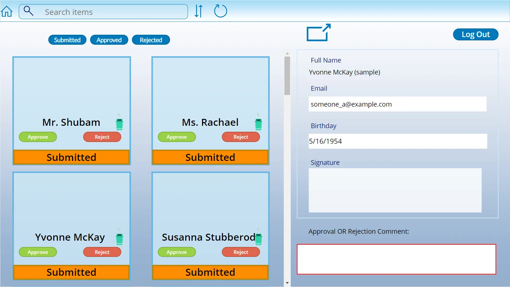
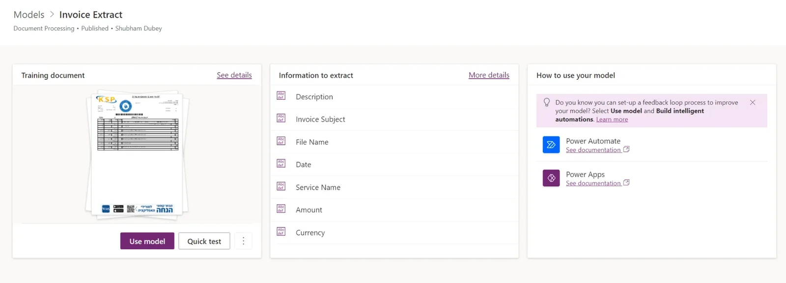

<h1 align="center">Hi, I'm Shubham 👋</h1>

<b>Dynamics 365 CE &amp; Power Platform Consultant</b> 
Canvas &amp; model-driven apps · Power Automate · Power BI · AI Builder · custom connectors

 

---

### About me
- 🧩 **5+ years** building business apps on the Microsoft stack.
- 🏥 Healthcare, 🏦 banking, and 🏗️ field-business projects: member services on D365, issue tracking & validation, inventory & job costing.
- 🤖 Currently working on **Copilot / LLM-assisted automation**: auto-generating process flows and architecture docs.
- 🌱 Learning full-stack web dev (TypeScript, React, SQL) in public.
- 🔭 Off the clock: deep space & astrophysics.

### Toolkit

### Featured work
| | |
|---|---|
|  **Inventory & Job Costing Platform** Canvas · Dataverse · barcode check-out · pick-sheet calculator |  **Product Attribute Search & Reports** Canvas · Dataverse · dynamic attribute filters |
|  **Employee Onboarding with AI Builder** Passport form processing · signatures · HR approvals |  **Invoice Extraction** AI Builder document processing → Power Automate |

➡️ **More case studies on my [portfolio site](https://shbh-mirai.github.io).**

### Certifications
`Power Platform Developer Associate` · `App Maker Associate` · `Functional Consultant Associate` · `Power Platform Fundamentals`
